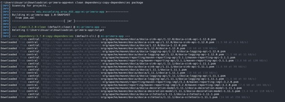

# Maven Review Hub

Este repositorio contiene información detallada sobre Maven, Git, GitHub y una pequeña aplicación de ejemplo que demuestra el uso de estas herramientas. El documento sirve como guía práctica para entender estas tecnologías fundamentales en el desarrollo de software moderno.

El documento de laboratorio completo está disponible en: [Lab1-Intro-Maven-Git-GitHub.pdf](src/site/resources/Lab1-Intro-Maven-Git-GitHub.pdf)

## Entorno de Desarrollo

Antes de comenzar con las herramientas específicas, es importante verificar la instalación de Java, que es un requisito para trabajar con Maven.

### Verificación de Java

Java es el lenguaje de programación en el que se desarrollará nuestra aplicación y es un requisito para Maven.

```bash
java -version
```


## Maven

### ¿Qué es Maven?

Maven es una herramienta de gestión y comprensión de proyectos de software que proporciona un modelo estándar para la gestión del ciclo de vida del proyecto. Maven se basa en el concepto de un modelo de objeto de proyecto (POM), y puede gestionar la construcción, los informes y la documentación de un proyecto desde una pieza central de información.

Maven resuelve dos aspectos principales del desarrollo de software:

1. Describe cómo se construye el software
2. Describe sus dependencias

### Características principales:

- **Gestión de dependencias**: Manejo automático de bibliotecas y sus dependencias.
- **Estructura de proyecto estandarizada**: Organización coherente para todos los proyectos Maven.
- **Ciclo de vida de construcción**: Fases predefinidas para compilar, probar, empaquetar y desplegar.
- **Plugins extensibles**: Funcionalidad adicional a través de plugins.
- **Repositorios centrales**: Acceso a un vasto ecosistema de bibliotecas.

### Verificación de Instalación

Para verificar que Maven está correctamente instalado en nuestro sistema, ejecutamos:

```bash
mvn -version
```


## Git

### ¿Qué es Git?

Git es un sistema de control de versiones distribuido, diseñado para manejar todo, desde proyectos pequeños hasta muy grandes, con velocidad y eficiencia. Git permite a los desarrolladores trabajar simultáneamente en el mismo proyecto sin interferir con el trabajo de los demás.

### Características principales:

- **Control de versiones distribuido**: Cada desarrollador tiene una copia completa del repositorio.
- **Branching y merging**: Facilita el trabajo paralelo y la integración.
- **Integridad de datos**: Todo en Git es verificado mediante checksums antes de ser almacenado.
- **Staging area**: Área intermedia para preparar commits específicos.

### Verificación de Instalación

Para verificar que Git está correctamente instalado en nuestro sistema, ejecutamos:

```bash
git --version
```


### Configuración Inicial de Git

Antes de comenzar a utilizar Git para nuestros proyectos, es necesario configurarlo con nuestros datos personales. Esto es importante ya que cada commit que hagamos quedará registrado con esta información.

```bash
git config --global user.name "Tu Nombre"
git config --global user.email "tu@email.com"
git config --global core.editor=emacs
```

Estas configuraciones globales aplican para todos los repositorios en nuestro sistema.

## GitHub

### ¿Qué es GitHub?

GitHub es una plataforma de alojamiento de código para el control de versiones y la colaboración. Permite a los desarrolladores trabajar juntos en proyectos desde cualquier lugar.

### Características principales:

- **Repositorios**: Almacenamiento centralizado de proyectos.
- **Pull Requests**: Mecanismo para revisar y discutir cambios antes de integrarlos.
- **Issues**: Seguimiento de tareas, mejoras y errores.
- **GitHub Actions**: Automatización de flujos de trabajo de desarrollo.
- **Colaboración social**: Funciones para facilitar la revisión y colaboración.

## Uso Práctico de las Herramientas

A continuación, se detallan los pasos y comandos utilizados para demostrar el uso práctico de Maven, Git y GitHub en el desarrollo de una aplicación Java simple.

### Creación de un Proyecto Maven

Para crear un nuevo proyecto Maven, utilizamos el comando `archetype:generate` que nos permite generar una estructura de proyecto estándar a partir de una plantilla (arquetipo):

```bash
mvn archetype:generate -DgroupId=edu.escuelaing.arsw.ASE.app -DartifactId=mi-primera-app -DarchetypeArtifactId=maven-archetype-quickstart -DinteractiveMode=false
```

Este comando crea un proyecto con:
- **groupId**: Identificador de la organización (edu.escuelaing.arsw.ASE.app)
- **artifactId**: Nombre del proyecto (mi-primera-app)
- **archetypeArtifactId**: Plantilla a utilizar (maven-archetype-quickstart)
- **interactiveMode**: Modo no interactivo para evitar preguntas durante la creación


### Exploración del Proyecto Generado

Una vez creado el proyecto, navegamos al directorio y exploramos su estructura:

```bash
cd mi-primera-app/
dir
```


Para visualizar la estructura completa del proyecto:

```bash
tree
```


### Compilación y Empaquetado del Proyecto

Maven facilita el proceso de construcción mediante fases predefinidas:

```bash
mvn package
```

Este comando compila el código, ejecuta las pruebas y empaqueta la aplicación en un archivo JAR.


### Ejecución de la Aplicación

Ejecutamos la aplicación Java utilizando el JAR generado:

```bash
java -cp target/mi-primera-app-1.0-SNAPSHOT.jar edu.escuelaing.arsw.ASE.app.App
```


### Ciclo de Vida de Maven

Maven organiza el proceso de construcción en fases. A continuación, ejecutamos un comando que demuestra varias fases:

```bash
mvn clean dependency:copy-dependencies package
```

Este comando:
1. **clean**: Elimina archivos generados anteriormente
2. **dependency:copy-dependencies**: Copia las dependencias a un directorio
3. **package**: Empaqueta el proyecto en un JAR



### Generación de Documentación con Maven

Maven permite generar documentación Javadoc utilizando diferentes comandos:

```bash
mvn javadoc:javadoc
mvn javadoc:jar
mvn javadoc:aggregate
mvn javadoc:aggregate-jar
mvn javadoc:test-javadoc
mvn javadoc:test-jar
mvn javadoc:test-aggregate
mvn javadoc:test-aggregate-jar
```

Estos comandos generan documentación en diferentes formatos y la empaquetan con el JAR.


### Comandos Git

A continuación, se presentan algunos de los comandos básicos de Git utilizados durante el desarrollo del proyecto:

```bash
# Inicializar un repositorio Git
git init

# Configurar usuario
git config --global user.name "Tu Nombre"
git config --global user.email "tu@email.com"

# Listar configuración
git config --list

# Añadir archivos al staging area
git add .

# Crear un commit
git commit -m "Primer commit"

# Enlazar con repositorio remoto
git remote add origin https://github.com/tu-usuario/maven-review-hub.git

# Ver repositorios remotos configurados
git remote -v

# Actualizar repositorio local con cambios remotos
git pull origin

# Actualizar repositorio local permitiendo historias no relacionadas
git pull origin --allow-unrelated-histories

# Subir cambios al repositorio remoto
git push origin

# Crear una nueva rama
git checkout -b nombre-rama

# Ver estado de archivos modificados de forma concisa
git status -s
```


### Gestión de Archivos con Git

Durante el desarrollo, es importante controlar qué archivos deben ser rastreados por Git. Para esto, utilizamos el archivo `.gitignore`:

```bash
# Añadir archivo .gitignore
echo '# Ignora todos los archivos en el directorio target en los proyectos creados con maven
target/' > .gitignore

# Verificar el estado después de añadir .gitignore
git status -s

# Añadir .gitignore al área de staging
git add .gitignore
```

### Clonación de Repositorios

Para verificar que los cambios se subieron correctamente al repositorio remoto, podemos clonar el repositorio:

```bash
# Salir del directorio actual
cd ..

# Clonar el repositorio
git clone https://github.com/tu-usuario/maven-review-hub.git

# Entrar al repositorio clonado
cd maven-review-hub

# Verificar que todo funciona correctamente
mvn package
```


## Proyecto Final de Laboratorio

Como parte del laboratorio, también se incluyen instrucciones para crear un nuevo proyecto y sincronizarlo con otro repositorio:

```bash
# Crear el proyecto para la primera tarea usando Maven
mvn archetype:generate -DgroupId=edu.escuelaing.arem -DartifactId=psp0 -DarchetypeArtifactId=maven-archetype-quickstart -DinteractiveMode=false
cd psp0

# Verificar que todo esté funcionando
mvn package

# Crear archivos recomendados
echo 'Mi primer proyecto' > README.txt
echo 'TODO: Copiar el texto de la licencia http://www.gnu.org/licenses/gpl.html' > LICENSE.txt
echo '# TODO: Copiar los contenidos de https://github.com/github/gitignore/blob/master/Java.gitignore' > .gitignore

# Crear el repositorio local de Git
git init

# Adicionar los archivos al control de Git
git add *.txt pom.xml .gitignore src
git status -s

# Agregar reglas a .gitignore
echo '# Ignora todos los archivos en el directorio target en los proyectos creados con maven
target/' >> .gitignore
git status -s

# Agregar .gitignore nuevamente al área staged
git add .gitignore

# Crear la primera versión del proyecto
git commit -m 'Primera versión de proyecto PSP0 de Andersson Sanchez'

# Crear un repositorio en GitHub y añadirlo como remoto
git remote add origin https://github.com/AnderssonProgramming/psp0.git

# Empujar el proyecto y hacer que Git rastree los cambios en el repositorio remoto
git push origin main
```


Estos comandos muestran el proceso completo de creación y gestión de un proyecto usando las herramientas estudiadas durante el laboratorio.

## Autor

Andersson Sánchez

## Licencia

Este proyecto está licenciado bajo los términos especificados en el archivo [LICENSE](LICENSE).